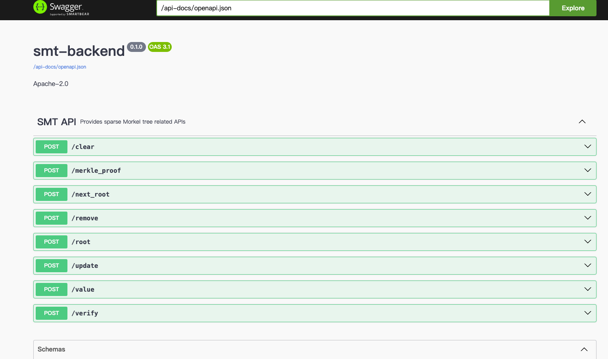

# subsmt
Sparse Merkle tree implementation in ink and substrate. Provide permanent storage off-chain backend based on rocksdb and paritydb. 

It can be applied in scenarios where Sparse Merkle Trees are used to save on-chain storage or computation resources, such as airdrops, game reward claims, and more. It provides a complete web backend functionality and the option to choose custom [hash algorithms](https://github.com/farcloud-labs/subsmt/blob/main/primitives/src/keccak_hasher.rs). Developers only need to modify the specific [implementation of keys and values](https://github.com/farcloud-labs/subsmt/blob/main/primitives/src/kv.rs) in the kv database, allowing them to quickly set up a web backend tailored to their project, along with on-chain verification templates or smart contracts. Its design follows the principle of minimizing the abuse of on-chain resources, ensuring that only the final verification needs to be implemented on-chain.

## Tech stack
* rust
* python
* polkadot-sdk
* actix-web
* swagger-ui
* parity-scale-codec
* sha3
* kvdb-rocksdb
* [sparse-merkle-tree](https://github.com/nervosnetwork/sparse-merkle-tree)

## apis

1. update_value
   ``` base 
    curl -X 'POST' \
    'http://localhost:8080/update' \
    -H 'accept: application/json' \
    -H 'Content-Type: application/json' \
    -d '{
    "address": "1H4GsGKaAv6VCwgx7gRgPm9AmCKqzEDjb2GyWoERj9xBRAH",
    "balance": "1000000000000",
    "nonce": 1,
    "prefix": "test"
    }'
   ```
    result: 
    ```bash
    "9978dd715a13f27c42fc832b6997cfd7013341790e651eb3781d4a7706e3a323"
    ```
    

2. get_value
    ``` bash
    curl -X 'POST' \
    'http://localhost:8080/value' \
    -H 'accept: application/json' \
    -H 'Content-Type: application/json' \
    -d '{
    "address": "1H4GsGKaAv6VCwgx7gRgPm9AmCKqzEDjb2GyWoERj9xBRAH",
    "prefix": "test" 
    }'
    ```
    result:
    ```bash
    {
    "nonce": 1,
    "balance": "1000000000000"
    }
    ```
2. get_merkle_proof
   ```base
    curl -X 'POST' \
    'http://localhost:8080/merkle_proof' \
    -H 'accept: application/json' \
    -H 'Content-Type: application/json' \
    -d '{
    "address": "1H4GsGKaAv6VCwgx7gRgPm9AmCKqzEDjb2GyWoERj9xBRAH",
    "prefix": "test"
    }'

   ```
   result:
   ```
    {
    "address": "1H4GsGKaAv6VCwgx7gRgPm9AmCKqzEDjb2GyWoERj9xBRAH",
    "nonce": 1,
    "balance": "1000000000000",
    "path": "71bf72e9e47f9a3bc183d7247bb87eb20cc7f5321d49a13f1210da88187efb80",
    "value_hash": "8300cd832a2edcbe835a1e918116c52226cd5202b2f8f8523949772f52970c85",
    "root": "9978dd715a13f27c42fc832b6997cfd7013341790e651eb3781d4a7706e3a323",
    "leave_bitmap": "0000000000000000000000000000000000000000000000000000000000000000",
    "siblings": []
    }
   ```
3. verify
   ```bash
    curl -X 'POST' \
    'http://localhost:8080/verify' \
    -H 'accept: application/json' \
    -H 'Content-Type: application/json' \
    -d '{
    "address": "1H4GsGKaAv6VCwgx7gRgPm9AmCKqzEDjb2GyWoERj9xBRAH",
    "nonce": 1,
    "balance": "1000000000000",
    "path": "71bf72e9e47f9a3bc183d7247bb87eb20cc7f5321d49a13f1210da88187efb80",
    "value_hash": "8300cd832a2edcbe835a1e918116c52226cd5202b2f8f8523949772f52970c85",
    "root": "9978dd715a13f27c42fc832b6997cfd7013341790e651eb3781d4a7706e3a323",
    "leave_bitmap": "0000000000000000000000000000000000000000000000000000000000000000",
    "siblings": []
    }'
   ```
   result:
   ```bash
   true
   ```
4. remove_value
   ```bash
    curl -X 'POST' \
    'http://localhost:8080/remove' \
    -H 'accept: application/json' \
    -H 'Content-Type: application/json' \
    -d '{
    "address": "test",
    "prefix": "1H4GsGKaAv6VCwgx7gRgPm9AmCKqzEDjb2GyWoERj9xBRAH"
    }'
   ```
   result:
   ```bash
   "0000000000000000000000000000000000000000000000000000000000000000"
   ```
5. get_next_root
    ```bash
    curl -X 'POST' \
    'http://localhost:8080/next_root' \
    -H 'accept: application/json' \
    -H 'Content-Type: application/json' \
    -d '{
    "address": "1H4GsGKaAv6VCwgx7gRgPm9AmCKqzEDjb2GyWoERj9xBRAH",
    "balance": "100",
    "nonce": 2,
    "prefix": "test"
    }'
    ```
    result:
    ```bash
    "6f4c5710e5ed2982d6c409d8b43693176086bfde7f01aeba64731a8a84a82ca2"
    ```
6. get_root
   ```bash
    curl -X 'POST' \
    'http://localhost:8080/root' \
    -H 'accept: application/json' \
    -H 'Content-Type: application/json' \
    -d '{
    "prefix": "test"
    }'
   ```
   result:
   ```
   "9978dd715a13f27c42fc832b6997cfd7013341790e651eb3781d4a7706e3a323" # fixme
   ```
7. clear
   ```bash
    curl -X 'POST' \
    'http://localhost:8080/clear' \
    -H 'accept: application/json' \
    -H 'Content-Type: application/json' \
    -d '{
    "prefix": "test"
    }'
   ```
   result:
   ```bash
   "0000000000000000000000000000000000000000000000000000000000000000"
   ```


***

## **DEV**

Clone the project
```
git clone https://github.com/farcloud-labs/subsmt.git
```


```
cd subsmt 
submodule update --init --recursive.
```

> As a developer, you don't even need to understand the specific implementation of the sparse Merkle tree, you can simply write a small amount of code to customize and extend your own Merkle tree backend. If you have such a need, you can modify the code in [these few places](./docs/).


### build


```
cargo build --release
```

### run

```
cargo run
```
or 
```
./target/release/smt
```

### Testing

#### Manual Testing
[http://localhost:8080/swagger-ui/](http://localhost:8080/swagger-ui/)



#### Unit Test Case

```
cargo test
```

## docker
todo

## License
This project is licensed under the LICENSE_APACHE2. See the [LICENSE](./LICENSE) file for details.


