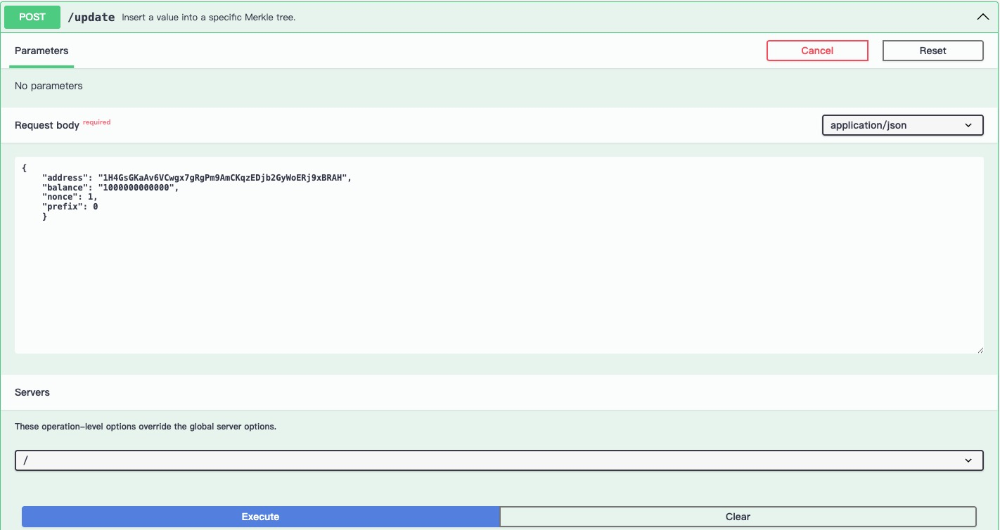
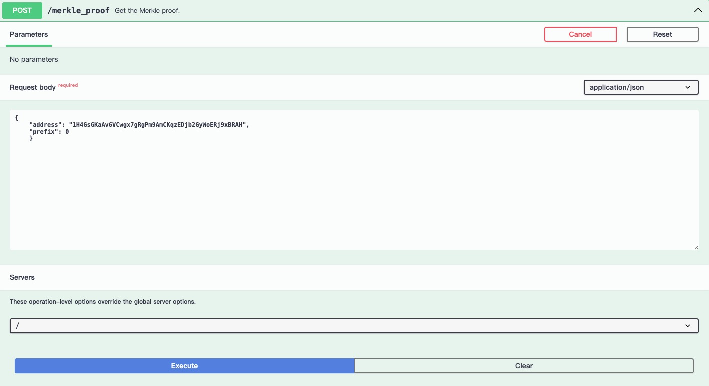
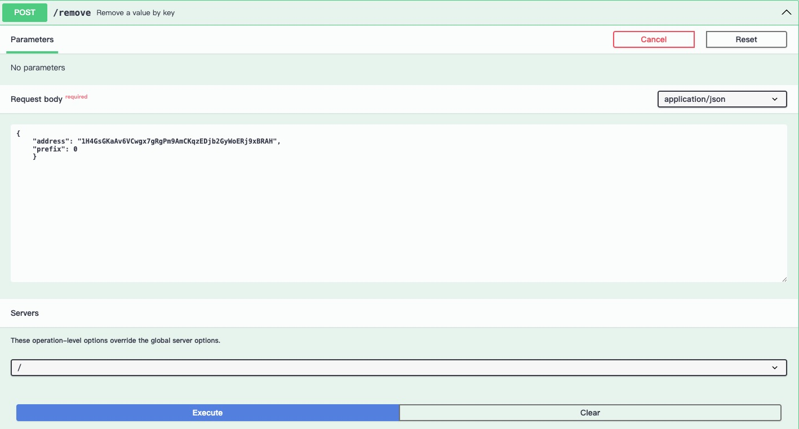
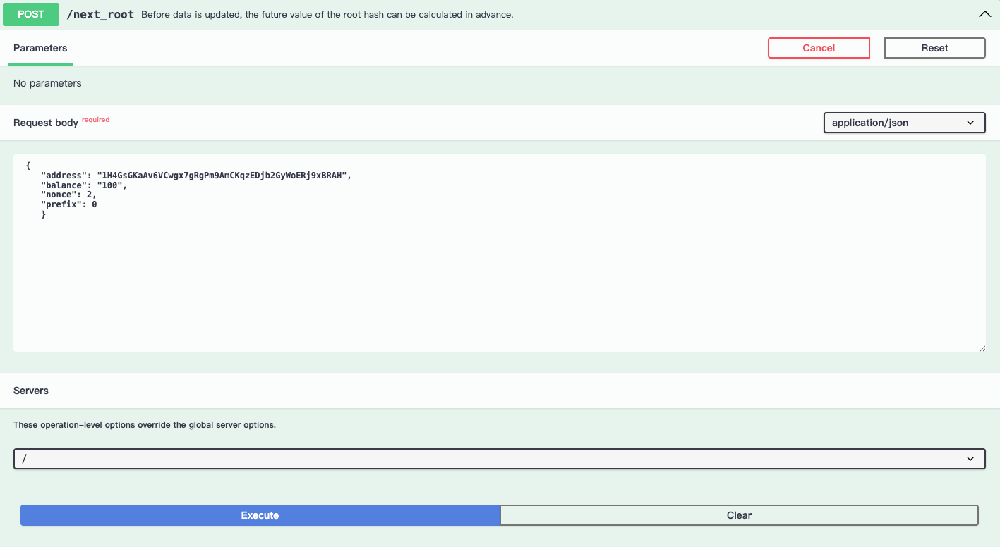
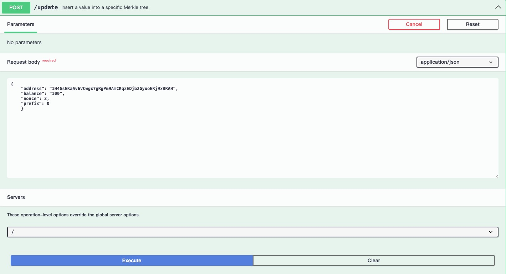
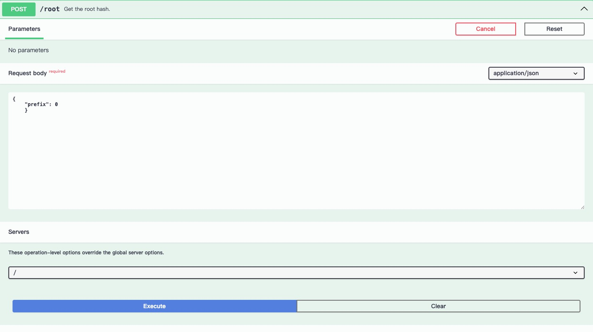
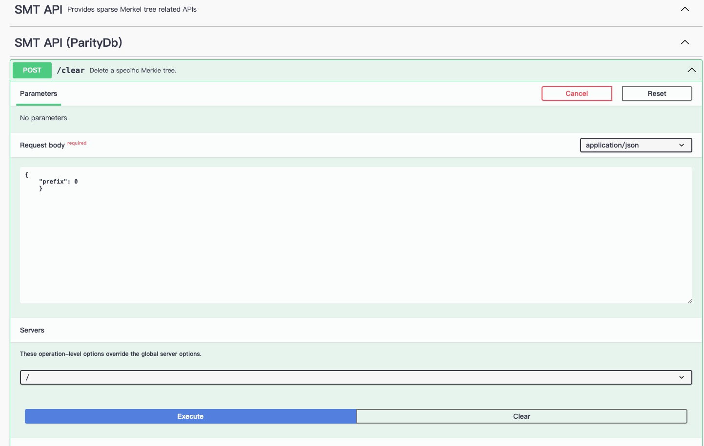
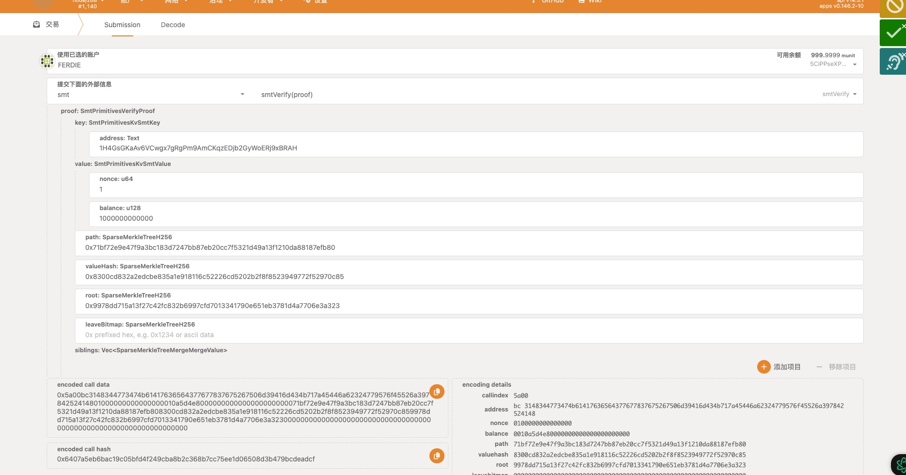

# Test Guide
This project has undergone comprehensive testing and is suitable for production use.

## Unit test

### code link
- https://github.com/farcloud-labs/subsmt/tree/main/backend/src/common-backend
- https://github.com/farcloud-labs/subsmt/tree/main/backend/src/parity
- https://github.com/farcloud-labs/subsmt/blob/main/backend/src/parity/parity_apis.rs
- https://github.com/farcloud-labs/subsmt/blob/main/backend/src/parity/parity_db.rs
- https://github.com/farcloud-labs/subsmt/blob/main/backend/src/parity/parity_req.rs
- https://github.com/farcloud-labs/subsmt/blob/main/backend/src/parity/parity_store.rs


### install  Rust environment

[https://docs.substrate.io/install/](https://docs.substrate.io/install/)
> Follow this document to set up your Rust environment.
### clone project
```
git clone git clone https://github.com/farcloud-labs/subsmt.git

cd subsmt 
git submodule update --init --recursive
```

### build 

#### local build
```
cargo build --release
```

#### docker build
```
docker buildx build -t smt:latest . --load

```
### run

#### local run
```
cargo run --bin paritydb-smt-backend
```

#### docker run

```
docker rmi -f yanoctavian/smt:latest
```
> Remove the image yanoctavian/smt:latest if it exists, and make sure you get the latest version of the image.
```
docker-compose up
```


### test

```
cargo test -- --nocapture

```
### Obtain test coverage report

Install tarpaulin

```
cargo install cargo-tarpaulin
```
Generate test report.

```
cargo tarpaulin --out Html --output-dir ./docs --exclude-files ./sparse-merkle-tree/*

```
Related output:
```
|| backend/src/common-backend/parity_backend.rs: 0/86 +0.00%
|| backend/src/parity/parity_apis.rs: 64/68 +0.00%
|| backend/src/parity/parity_db.rs: 32/41 +0.00%
|| backend/src/parity/parity_store.rs: 29/29 +0.00%

```
> Note: The backend functionality testing has already been implemented in `parity_apis` tests and manual testing, so no additional testing is needed here

> [test report](./tarpaulin-report.html)


## Manual testing
### Start Docker
```
docker-compose up
```

### swagger-ui testing

The `prefix` is the name of the Merkle tree, and each Merkle tree is different.

[http://localhost:8081/swagger-ui/#](http://localhost:8081/swagger-ui/#)
1. `update_value`  
   > Be used to insert, update, or delete a specific Merkle leaf value.

    Request body:
    ```
    {
    "address": "1H4GsGKaAv6VCwgx7gRgPm9AmCKqzEDjb2GyWoERj9xBRAH",
    "balance": "1000000000000",
    "nonce": 1,
    "prefix": 0
    }

    ```
    

    reslut:
    ```
    "9978dd715a13f27c42fc832b6997cfd7013341790e651eb3781d4a7706e3a323"
    ```
2. get_value
   > Here, you can retrieve the value that was inserted in step 1.

   Request body:
   ```
   {
    "address": "1H4GsGKaAv6VCwgx7gRgPm9AmCKqzEDjb2GyWoERj9xBRAH",
    "prefix": 0
    }
   ```
   
   result:
   ```
   {
    "nonce": 1,
    "balance": "1000000000000"
    }

   ```
3. `get_merkle_proof`
   > This API can retrieve the Merkle proof for a specific key, which can be submitted to the blockchain for verification.

   Request body:
   ```
   {
    "address": "1H4GsGKaAv6VCwgx7gRgPm9AmCKqzEDjb2GyWoERj9xBRAH",
    "prefix": 0
    }
   ```
   
   result:
   ```
    {
    "address": "1H4GsGKaAv6VCwgx7gRgPm9AmCKqzEDjb2GyWoERj9xBRAH",
    "nonce": 1,
    "balance": "1000000000000",
    "path": "71bf72e9e47f9a3bc183d7247bb87eb20cc7f5321d49a13f1210da88187efb80",
    "value_hash": "8300cd832a2edcbe835a1e918116c52226cd5202b2f8f8523949772f52970c85",
    "root": "9978dd715a13f27c42fc832b6997cfd7013341790e651eb3781d4a7706e3a323",
    "leave_bitmap": "0000000000000000000000000000000000000000000000000000000000000000",
    "siblings": []
    }

   ```
4. `verify`
   > This API can verify the Merkle proof obtained in step 3, return  `true` indicates the proof is valid.
   
   Request body:
   ```
   {
    "address": "1H4GsGKaAv6VCwgx7gRgPm9AmCKqzEDjb2GyWoERj9xBRAH",
    "nonce": 1,
    "balance": "1000000000000",
    "path": "71bf72e9e47f9a3bc183d7247bb87eb20cc7f5321d49a13f1210da88187efb80",
    "value_hash": "8300cd832a2edcbe835a1e918116c52226cd5202b2f8f8523949772f52970c85",
    "root": "9978dd715a13f27c42fc832b6997cfd7013341790e651eb3781d4a7706e3a323",
    "leave_bitmap": "0000000000000000000000000000000000000000000000000000000000000000",
    "siblings": []
    }
   ```
   
   Result:
   ```
   true
   ```
5. `remove_value`
   > Delete a specific leaf value. Here, we are removing the value inserted in step 1.Return the Merkle tree root hash after the deletion.

   Request body:
   ```
   {
    "address": "1H4GsGKaAv6VCwgx7gRgPm9AmCKqzEDjb2GyWoERj9xBRAH",
    "prefix": 0
    }

   ```
   
   Result:
   ```
   "0000000000000000000000000000000000000000000000000000000000000000"
   ```
6. `get_next_root`
   > Suppose you want to update a leaf value but don't want to actually perform the update. However, you'd like to know the updated Merkle tree root hash. This API is very useful for that.

   Request body:
   ```
   {
    "address": "1H4GsGKaAv6VCwgx7gRgPm9AmCKqzEDjb2GyWoERj9xBRAH",
    "balance": "100",
    "nonce": 2,
    "prefix": 0
    }

   ```
   
   Result:
   ```
   "6f4c5710e5ed2982d6c409d8b43693176086bfde7f01aeba64731a8a84a82ca2"
   ```
7. `update_value`
   > Here, we insert the value from step 6 and return the actual Merkle tree root hash. We find that it matches the result from step 6, indicating that the step 6 test has passed.

   Request body:
   ```
   {
    "address": "1H4GsGKaAv6VCwgx7gRgPm9AmCKqzEDjb2GyWoERj9xBRAH",
    "balance": "100",
    "nonce": 2,
    "prefix": 0
    }
   ```
   
   Result:
   ```
   "6f4c5710e5ed2982d6c409d8b43693176086bfde7f01aeba64731a8a84a82ca2"
   ```
8. `get_root`
   > Retrieve the Merkle tree root hash. The value here should be the same as in step 7.
   Request body:
   ```
   {
    "prefix": 0
    }

   ```
   
   Result:
   ```
   "6f4c5710e5ed2982d6c409d8b43693176086bfde7f01aeba64731a8a84a82ca2"
   ```
9.  `clear`
    > Delete all the leaves in the Merkle tree and return the Merkle tree root hash after the deletion. Return the Merkle root, which must be the value '0000000000000000000000000000000000000000000000000000000000000000'.

    Request body:
   ```
   {
    "prefix": 0
    }

   ```
   
   Result:
   ```
   "0000000000000000000000000000000000000000000000000000000000000000"
   ```

   
### On-chain testing
Submit the Merkle proof obtained in step 3 to the blockchain for verification.
[explorer](https://polkadot.js.org/apps/?rpc=ws%3A%2F%2F127.0.0.1%3A9944#/explorer)

```
{
    "address": "1H4GsGKaAv6VCwgx7gRgPm9AmCKqzEDjb2GyWoERj9xBRAH",
    "nonce": 1,
    "balance": "1000000000000",
    "path": "71bf72e9e47f9a3bc183d7247bb87eb20cc7f5321d49a13f1210da88187efb80",
    "value_hash": "8300cd832a2edcbe835a1e918116c52226cd5202b2f8f8523949772f52970c85",
    "root": "9978dd715a13f27c42fc832b6997cfd7013341790e651eb3781d4a7706e3a323",
    "leave_bitmap": "0000000000000000000000000000000000000000000000000000000000000000",
    "siblings": []
}
```

> Note: the path, value_hash, root, and leaf_bitmap here should have the `0x` prefix.




