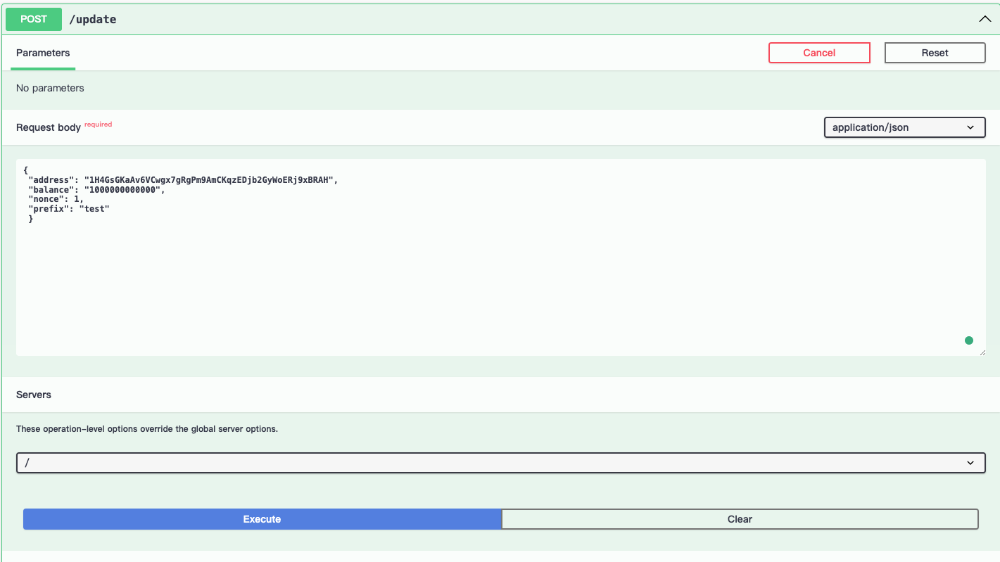
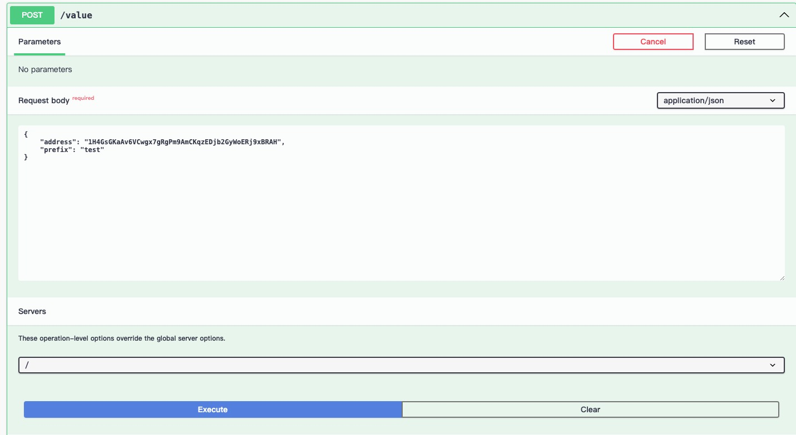
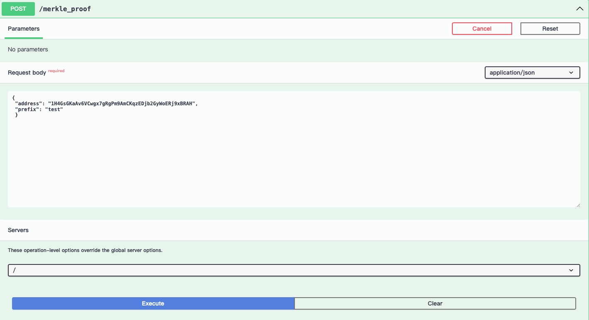
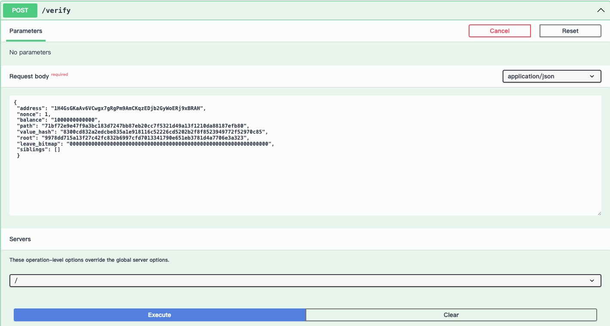
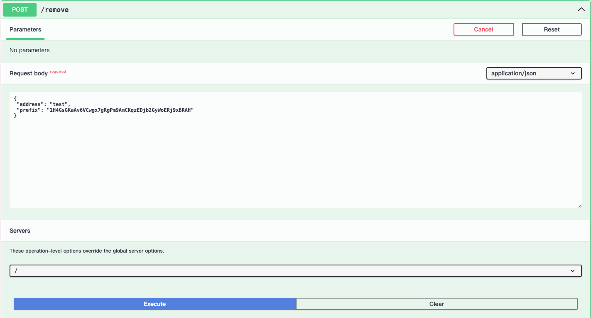
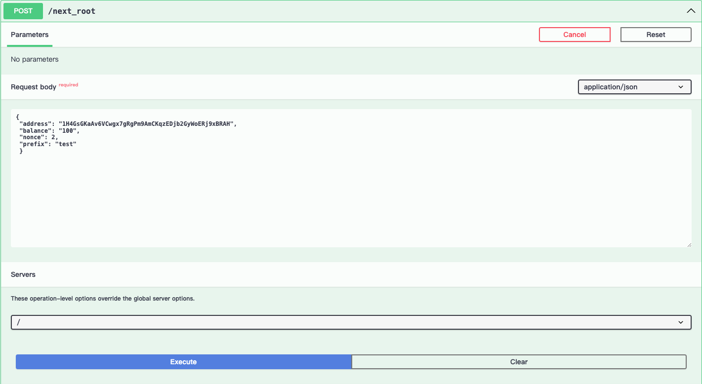
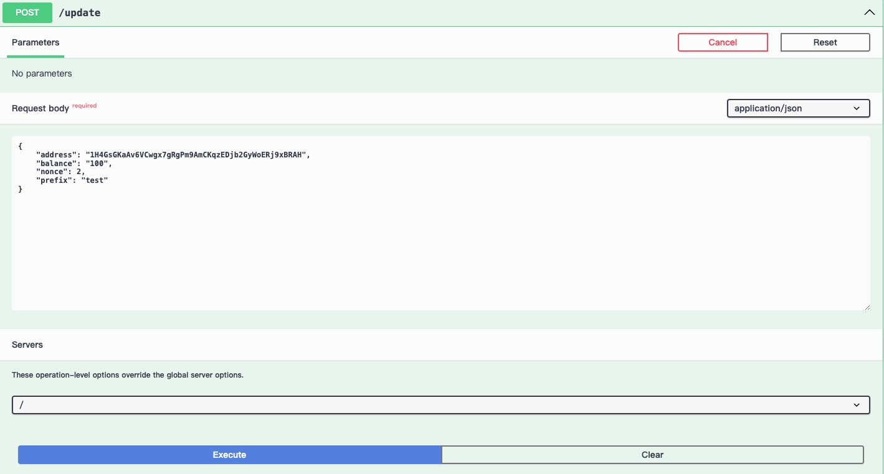
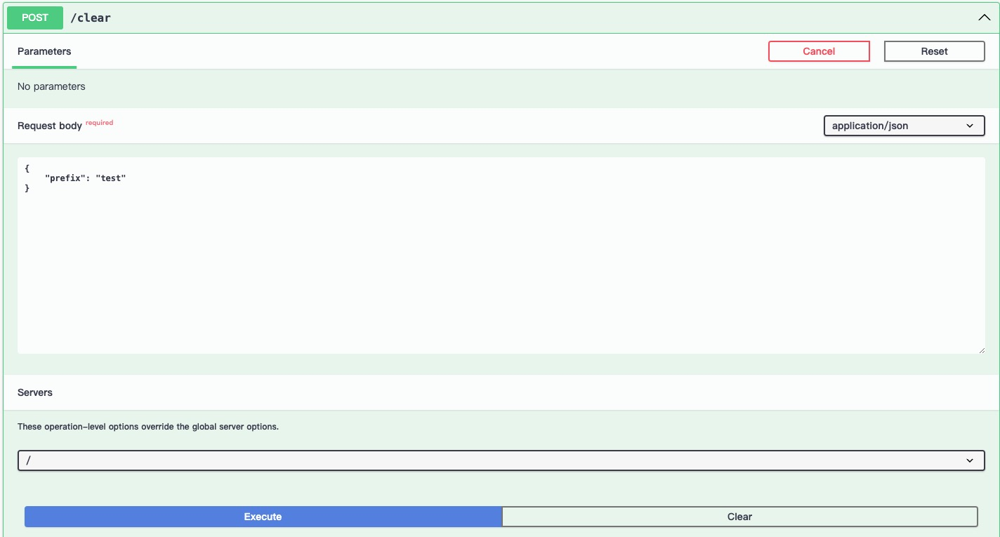
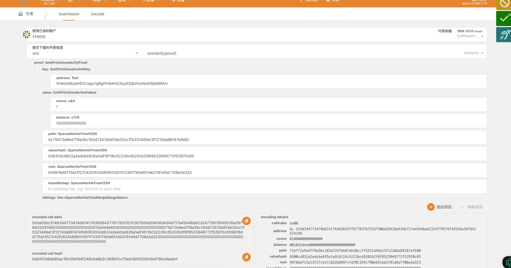

# Test Guide
This project has undergone comprehensive testing and is suitable for production use.

## Unit test

### Test code link
- https://github.com/farcloud-labs/subsmt/blob/main/backend/src/apis.rs#L188
- https://github.com/farcloud-labs/subsmt/blob/main/backend/src/store.rs#L114
- https://github.com/farcloud-labs/subsmt/blob/main/pallet/SMT/src/tests.rs
- https://github.com/farcloud-labs/subsmt/blob/main/ink-contract/SMT/lib.rs#L74
- https://github.com/farcloud-labs/subsmt/blob/main/primitives/src/keccak_hasher.rs#L52
- https://github.com/farcloud-labs/subsmt/blob/main/primitives/src/kv.rs#L178
### install  Rust environment

[https://docs.substrate.io/install/](https://docs.substrate.io/install/)
> "Follow this document to set up your Rust environment."
### clone project
```
git clone git clone https://github.com/farcloud-labs/subsmt.git

cd subsmt 
git submodule update --init --recursive
```
### test

```
cargo test -- --nocapture

```
### Obtain test coverage report

Generate test report.

```
cargo tarpaulin --out Html --output-dir ./docs --exclude-files ./sparse-merkle-tree/*

```
> [test report](./tarpaulin-report.html)
## Manual testing
### Start Docker
```
docker-compose up
```

### swagger-ui testing

[http://localhost:8080/swagger-ui/#](http://localhost:8080/swagger-ui/#)
1. update_value

    Request body:
    ```
    {
    "address": "1H4GsGKaAv6VCwgx7gRgPm9AmCKqzEDjb2GyWoERj9xBRAH",
    "balance": "1000000000000",
    "nonce": 1,
    "prefix": "test"
    }

    ```
    

    reslut:
    ```
    "9978dd715a13f27c42fc832b6997cfd7013341790e651eb3781d4a7706e3a323"
    ```
2. get_value
   Request body:
   ```
   {
    "address": "1H4GsGKaAv6VCwgx7gRgPm9AmCKqzEDjb2GyWoERj9xBRAH",
    "prefix": "test" 
    }
   ```
   
   result:
   ```
   {
    "nonce": 1,
    "balance": "1000000000000"
    }

   ```
3. get_merkle_proof
   Request body:
   ```
   {
    "address": "1H4GsGKaAv6VCwgx7gRgPm9AmCKqzEDjb2GyWoERj9xBRAH",
    "prefix": "test"
    }
   ```
   
   result:
   ```
    {
    "address": "1H4GsGKaAv6VCwgx7gRgPm9AmCKqzEDjb2GyWoERj9xBRAH",
    "nonce": 1,
    "balance": "1000000000000",
    "path": "71bf72e9e47f9a3bc183d7247bb87eb20cc7f5321d49a13f1210da88187efb80",
    "value_hash": "8300cd832a2edcbe835a1e918116c52226cd5202b2f8f8523949772f52970c85",
    "root": "9978dd715a13f27c42fc832b6997cfd7013341790e651eb3781d4a7706e3a323",
    "leave_bitmap": "0000000000000000000000000000000000000000000000000000000000000000",
    "siblings": []
    }

   ```
4. verify
   Request body:
   ```
   {
    "address": "1H4GsGKaAv6VCwgx7gRgPm9AmCKqzEDjb2GyWoERj9xBRAH",
    "nonce": 1,
    "balance": "1000000000000",
    "path": "71bf72e9e47f9a3bc183d7247bb87eb20cc7f5321d49a13f1210da88187efb80",
    "value_hash": "8300cd832a2edcbe835a1e918116c52226cd5202b2f8f8523949772f52970c85",
    "root": "9978dd715a13f27c42fc832b6997cfd7013341790e651eb3781d4a7706e3a323",
    "leave_bitmap": "0000000000000000000000000000000000000000000000000000000000000000",
    "siblings": []
    }
   ```
   
   Result:
   ```
   true
   ```
5. remove_value
   Request body:
   ```
   {
    "address": "test",
    "prefix": "1H4GsGKaAv6VCwgx7gRgPm9AmCKqzEDjb2GyWoERj9xBRAH"
    }

   ```
   
   Result:
   ```
   "0000000000000000000000000000000000000000000000000000000000000000"
   ```
6. get_next_root
   Request body:
   ```
   {
    "address": "1H4GsGKaAv6VCwgx7gRgPm9AmCKqzEDjb2GyWoERj9xBRAH",
    "balance": "100",
    "nonce": 2,
    "prefix": "test"
    }

   ```
   
   Result:
   ```
   "6f4c5710e5ed2982d6c409d8b43693176086bfde7f01aeba64731a8a84a82ca2"
   ```
7. update_value
   Request body:
   ```
   {
    "address": "1H4GsGKaAv6VCwgx7gRgPm9AmCKqzEDjb2GyWoERj9xBRAH",
    "balance": "100",
    "nonce": 2,
    "prefix": "test"
    }
   ```
   
   Result:
   ```
   "6f4c5710e5ed2982d6c409d8b43693176086bfde7f01aeba64731a8a84a82ca2"
   ```
8. get_root
   Request body:
   ```
   {
    "prefix": "test"
    }

   ```
   
   Result:
   ```
   "6f4c5710e5ed2982d6c409d8b43693176086bfde7f01aeba64731a8a84a82ca2"
   ```
9. clear
    Request body:
   ```
   {
    "prefix": "test"
    }

   ```
   
   Result:
   ```
   "0000000000000000000000000000000000000000000000000000000000000000"
   ```

   
### On-chain testing

```
{
    "address": "1H4GsGKaAv6VCwgx7gRgPm9AmCKqzEDjb2GyWoERj9xBRAH",
    "nonce": 1,
    "balance": "1000000000000",
    "path": "71bf72e9e47f9a3bc183d7247bb87eb20cc7f5321d49a13f1210da88187efb80",
    "value_hash": "8300cd832a2edcbe835a1e918116c52226cd5202b2f8f8523949772f52970c85",
    "root": "9978dd715a13f27c42fc832b6997cfd7013341790e651eb3781d4a7706e3a323",
    "leave_bitmap": "0000000000000000000000000000000000000000000000000000000000000000",
    "siblings": []
}
```




